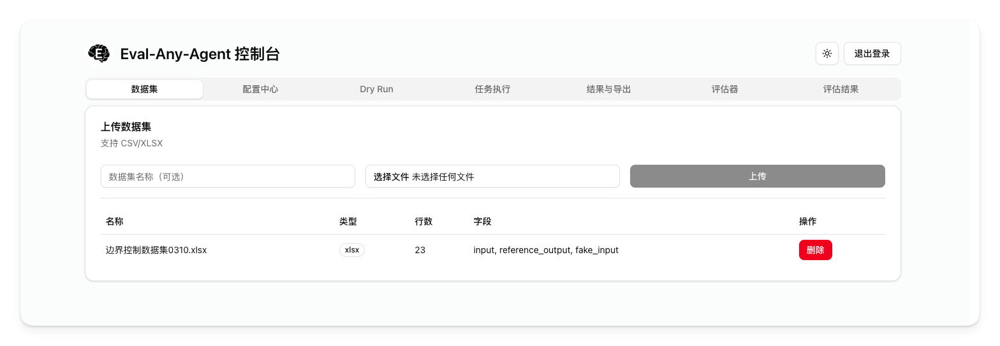

# Eval-Any-Agent 私有化部署与使用指南

[中文](./README.md) | [English](./README.en.md)



Eval-Any-Agent 是一个面向企业内网和私有环境的 LLM 批量评测平台。你可以上传 CSV/XLSX 数据集，配置待测接口的请求模板，批量调用上游 Agent/模型服务，记录响应、延迟、结束信号和错误信息，并可进一步使用 LLM 评估器对结果打分，最后导出 CSV/XLSX 报告。

本文档面向部署和使用人员，优先说明如何把服务跑起来、如何配置评测任务、如何查看和导出结果。

## 适用场景

- 私有化部署在公司服务器、内网机器或单机 Docker 环境
- 批量评测 Agent、聊天机器人、OpenAI-compatible 接口或自定义流式接口
- 用表格数据批量构造请求，例如每行一条问题、会话 ID、用户画像或标准答案
- 统计首 token 时间、总耗时、成功失败状态和提取后的业务字段
- 使用 LLM-as-a-Judge 对任务结果进行自动评分和通过判定

## 核心能力

- 管理员登录与会话鉴权
- CSV、XLSX、XLS 数据集上传和预览
- 请求配置中心：上游 URL、Header、请求体模板、输入绑定、输出提取规则
- 支持 SSE、NDJSON、纯文本及自动识别的流式响应解析
- 支持结束信号规则：`[DONE]`、JSONPath 条件、事件名、连接关闭、空闲超时
- Dry Run 单条试跑，正式批量任务前可先验证配置
- 批量任务执行，支持并发、超时、重试、暂停、继续、终止
- 结果分页查看，支持动态字段列和 CSV/XLSX 导出
- 模型配置与评估器配置，支持 OpenAI-compatible 评估模型
- 评估任务结果导出，包含评分、通过状态、原因和原始响应

## 推荐部署方式

生产或准生产环境推荐使用 Docker Compose 部署。仓库已内置：

- `app`：Next.js 应用，内置 SQLite 初始化逻辑
- `nginx`：HTTPS 反向代理
- `app_data`：Docker 命名卷，用于持久化 SQLite 数据库

默认容器内数据库路径为 `/app/data/dev.db`，映射到 Docker 命名卷 `app_data`。重建容器不会删除数据，只有删除 Docker 卷才会清空数据库。

## 服务器要求

最低建议配置：

- Linux x86_64 服务器
- Docker 24+
- Docker Compose v2
- 2 核 CPU、4 GB 内存起步
- 可访问上游待测接口和评估模型接口
- 已准备域名或服务器 IP
- 生产环境建议准备受信任 CA 签发的 HTTPS 证书

端口默认值：

- HTTP：`18080`，会跳转到 HTTPS
- HTTPS：`18443`
- 应用内部端口：`3000`

## 一键部署流程

### 1. 获取 Docker 部署包

推荐普通部署用户在 GitHub Release 页面下载 Docker 部署包：

```text
eval-any-agent-docker-nightly.tar.gz
```

解压：

```bash
tar -xzf eval-any-agent-docker-nightly.tar.gz
cd Eval-Any-Agent-Docker
```

该部署包只包含 Docker Compose 和 Nginx 配置，会从 GHCR 拉取预构建镜像，不包含源码、真实环境变量或证书文件。

如果需要源码安装包，可下载：

```text
eval-any-agent-nightly.tar.gz
```

### 2. 准备环境变量

```bash
cp env/.env.docker.example env/.env.docker
```

编辑 `env/.env.docker`：

```dotenv
NODE_ENV=production
APP_IMAGE=ghcr.io/eis4ty/eval-any-agent:latest
AUTH_SECRET=please-change-this-to-a-long-random-string
DEFAULT_ADMIN_USERNAME=admin
DEFAULT_ADMIN_PASSWORD=change-this-password
DATABASE_URL=file:/app/data/dev.db
APP_PORT=3000
NGINX_HTTP_PORT=18080
NGINX_HTTPS_PORT=18443
```

必须修改：

- `AUTH_SECRET`：登录会话签名密钥，请设置为足够长的随机字符串
- `DEFAULT_ADMIN_PASSWORD`：首次初始化数据库时创建的管理员密码

按需修改：

- `DEFAULT_ADMIN_USERNAME`：默认管理员用户名
- `APP_IMAGE`：默认拉取 `ghcr.io/eis4ty/eval-any-agent:latest`
- `NGINX_HTTP_PORT`：宿主机 HTTP 端口
- `NGINX_HTTPS_PORT`：宿主机 HTTPS 端口

注意：默认管理员账号只会在数据库首次初始化时创建。如果数据库已经存在，后续修改 `DEFAULT_ADMIN_PASSWORD` 不会自动改旧账号密码。

### 3. 准备 HTTPS 证书

将证书放到 `docker/nginx/ssl/`，文件名必须为：

```text
fullchain.pem
privkey.pem
```

仅本地测试可生成自签证书：

```bash
openssl req -x509 -nodes -days 365 \
  -newkey rsa:2048 \
  -keyout docker/nginx/ssl/privkey.pem \
  -out docker/nginx/ssl/fullchain.pem \
  -subj "/CN=localhost"
```

生产环境请使用受信任 CA 证书，避免浏览器拦截或接口调用方不信任证书。

### 4. 启动服务

Docker 部署包默认拉取 GHCR 预构建镜像。首次部署执行：

```bash
docker compose \
  --env-file env/.env.docker \
  -f docker-compose.yml \
  -f docker-compose.deploy.yml \
  up -d
```

如果不想把 `APP_IMAGE` 写入 `env/.env.docker`，也可以临时传入：

```bash
APP_IMAGE=ghcr.io/eis4ty/eval-any-agent:latest docker compose \
  --env-file env/.env.docker \
  -f docker-compose.yml \
  -f docker-compose.deploy.yml \
  up -d
```

### 5. 检查服务状态

```bash
docker compose --env-file env/.env.docker -f docker-compose.yml -f docker-compose.deploy.yml ps
docker compose --env-file env/.env.docker -f docker-compose.yml -f docker-compose.deploy.yml logs -f app
```

首次启动时，`app` 日志中应看到数据库初始化和默认管理员创建信息。

### 6. 访问系统

浏览器打开：

```text
https://<服务器IP或域名>:18443/login
```

如果修改了 `NGINX_HTTPS_PORT`，请使用对应端口。

登录账号来自 `env/.env.docker`：

- 用户名：`DEFAULT_ADMIN_USERNAME`
- 密码：`DEFAULT_ADMIN_PASSWORD`

## 升级与重启

Docker 部署包升级：

```bash
docker compose --env-file env/.env.docker -f docker-compose.yml -f docker-compose.deploy.yml pull
docker compose --env-file env/.env.docker -f docker-compose.yml -f docker-compose.deploy.yml up -d
```

重启服务：

```bash
docker compose --env-file env/.env.docker -f docker-compose.yml -f docker-compose.deploy.yml restart
```

停止服务：

```bash
docker compose --env-file env/.env.docker -f docker-compose.yml -f docker-compose.deploy.yml down
```

停止服务不会删除 SQLite 数据。不要随意执行 `docker volume rm`，否则可能删除评测数据。

## 数据备份与恢复

数据库保存在 Docker 卷 `eval-any-agent_app_data` 或类似名称中，实际名称可通过以下命令查看：

```bash
docker volume ls | grep app_data
```

备份 SQLite 数据库：

```bash
docker compose --env-file env/.env.docker -f docker-compose.yml -f docker-compose.deploy.yml exec app sh -c 'sqlite3 /app/data/dev.db ".backup /app/data/backup.db"'
docker cp "$(docker compose --env-file env/.env.docker -f docker-compose.yml -f docker-compose.deploy.yml ps -q app)":/app/data/backup.db ./backup.db
```

恢复前请先停止服务并确认当前数据可覆盖。以下命令中的 `VOLUME_NAME` 请替换为上一步查到的卷名：

```bash
docker compose --env-file env/.env.docker -f docker-compose.yml -f docker-compose.deploy.yml down
docker run --rm \
  -v VOLUME_NAME:/data \
  -v "$PWD":/backup \
  busybox sh -c 'cp /backup/backup.db /data/dev.db'
docker compose --env-file env/.env.docker -f docker-compose.yml -f docker-compose.deploy.yml up -d
```

## 使用流程总览

推荐按以下顺序完成一次评测：

1. 登录系统
2. 上传数据集
3. 新建请求配置
4. 使用 Dry Run 验证单条请求
5. 创建批量任务
6. 查看任务进度和运行结果
7. 导出原始评测结果
8. 可选：配置评估模型和评估器
9. 可选：创建 LLM 评估任务并导出评分结果

## 第一步：准备数据集

进入「数据集」页，上传 CSV、XLSX 或 XLS 文件。

建议数据集第一行为字段名，例如：

```csv
msg,sessionId,reference_output
介绍一下你自己,s001,应该说明身份和主要能力
帮我写一封请假邮件,s002,应该包含请假原因和礼貌表达
```

字段说明：

- `msg`：待发送给上游接口的问题或输入
- `sessionId`：会话 ID，可选
- `reference_output`：标准答案或评分参考，可选，评估器默认会读取该字段

上传后系统会记录列名、行数和原始行数据。后续请求模板中的变量需要和数据集列名对应。

## 第二步：配置待测接口

进入「配置中心」，创建一条请求配置。

### 基本信息

- 配置名称：便于识别，例如 `生产 Agent v1`
- 上游 API URL：待测服务的完整请求地址，例如 `https://api.example.com/chat`

### 输入绑定

输入绑定用于说明“模板变量从数据集哪一列取值”。

示例：

```json
[
  { "placeholder": "msg", "column": "msg" },
  { "placeholder": "sessionId", "column": "sessionId" }
]
```

含义：

- `{{msg}}` 会被替换为当前行的 `msg` 列
- `{{sessionId}}` 会被替换为当前行的 `sessionId` 列

### Header 配置

示例：

```json
{
  "Content-Type": "application/json",
  "Authorization": "Bearer your-api-key"
}
```

如果上游服务不需要鉴权，可以只保留 `Content-Type`。

### 请求体模板

请求体模板使用 Mustache 变量语法。

示例：

```json
{
  "msg": "{{msg}}",
  "sessionId": "{{sessionId}}",
  "stream": true
}
```

执行任务时，每一行数据都会生成一份独立请求体。

### 输出提取规则

提取规则用于从上游响应中抽取你关心的字段，路径使用 JSONPath。

示例：

```json
[
  { "key": "text", "path": "$.text" },
  { "key": "thinking", "path": "$.thinkcontent" }
]
```

导出结果时，`text`、`thinking` 会作为输出字段出现。

### 流式协议

可选值：

- `auto`：自动识别，推荐优先使用
- `sse`：Server-Sent Events
- `ndjson`：一行一个 JSON
- `plain_text`：纯文本

### 结束信号规则

常见配置：

```json
[
  { "type": "sentinel_text", "value": "[DONE]" },
  { "type": "json_path_equals", "path": "$.type", "equals": 2 }
]
```

规则类型：

- `sentinel_text`：响应中出现指定文本即认为结束
- `json_path_equals`：某个 JSONPath 的值等于指定值即认为结束
- `event_name`：SSE 事件名命中即认为结束
- `connection_close`：连接关闭即认为结束
- `max_idle_ms`：超过指定空闲时间即认为结束

如果开启 `done_required`，未命中显式结束规则时会标记为 `END_SIGNAL_MISSING`，适合严格检查流式接口是否规范结束。

### 解析 Curl

配置中心支持粘贴 curl 命令并自动填充 URL、Header 和请求体。建议先用 curl 导入基础配置，再检查输入绑定、提取规则和结束信号。

## 第三步：Dry Run 试跑

进入「Dry Run」页：

1. 选择数据集
2. 选择请求配置
3. 点击运行

Dry Run 会使用数据集中的样例行请求上游接口，并展示解析后的结果。正式批量任务前建议重点检查：

- 上游接口是否能访问
- Header 鉴权是否正确
- 模板变量是否替换成功
- 输出字段是否提取到了预期内容
- 结束信号是否符合预期
- 是否出现超时或解析错误

## 第四步：创建批量任务

进入「任务执行」页：

1. 选择数据集
2. 选择请求配置
3. 设置并发数、超时时间和重试次数
4. 点击创建任务

参数建议：

- 并发数：从 `5` 或 `10` 开始，确认上游稳定后再提高
- 超时时间：单位毫秒，例如 `60000` 表示 60 秒
- 重试次数：建议 `1` 到 `2`，避免上游异常时放大压力

任务状态：

- `running`：执行中
- `paused`：已暂停
- `stopped`：已终止
- `completed`：已完成
- `failed`：任务失败

可对执行中的任务进行暂停、继续和终止操作。

## 第五步：查看和导出结果

进入「结果与导出」页：

1. 选择任务
2. 查看分页结果
3. 调整需要导出的字段
4. 导出 XLSX 或 CSV

结果中常见字段：

- 原始输入列：来自上传的数据集
- `outputs`：按提取规则得到的输出字段
- `ttftMs`：首 token 时间
- `latencyMs`：总耗时
- `status`：单行执行状态
- `errorType`、`errorMessage`：错误类型和错误信息
- `endReason`、`ruleHit`：结束原因和命中的结束规则
- `rawTrace`：原始响应轨迹，便于排查接口问题

## 可选：配置 LLM 评估器

如果需要自动评分，进入「评估器」页，先创建模型配置，再创建评估器。

### 模型配置

当前支持 OpenAI-compatible 接口。

字段说明：

- 配置名称：例如 `内网评估模型`
- Base URL：例如 `https://api.openai.com/v1` 或内网兼容地址
- API Key：模型服务密钥
- 默认模型名：例如 `gpt-4o-mini` 或你的内网模型名
- 启用该模型配置：只有启用后才会用于评估器

### 评估器

评估器由 System Prompt、User Prompt 和评分区间组成。评估模型必须返回 JSON：

```json
{
  "score": 85,
  "reason": "回答覆盖了核心要点，但缺少具体步骤。",
  "passed": true
}
```

User Prompt 可使用变量：

- `{{input.xxx}}`：原始输入字段，例如 `{{input.msg}}`
- `{{outputs.xxx}}`：任务输出字段，例如 `{{outputs.text}}`
- `{{result.status}}`：原任务单行状态
- `{{result.latencyMs}}`：原任务单行耗时
- `{{reference_output}}`：默认绑定到输入数据中的 `reference_output`

示例 User Prompt：

```text
请根据参考答案评估模型回答质量。

用户问题：
{{input.msg}}

参考答案：
{{reference_output}}

模型回答：
{{outputs.text}}

请只返回 JSON，字段包括 score、reason、passed。
```

创建评估器后，建议选择一条已有任务结果进行 Dry Run，确认评估模型返回格式正确。

## 可选：创建评估任务

在「评估器」页下方：

1. 选择来源任务
2. 勾选一个或多个评估器
3. 点击开始评估

进入「评估结果」页可查看：

- 平均分
- 通过率
- 每行评分
- 评估原因
- 原始评估响应

评估结果同样支持 CSV/XLSX 导出。

## 常见问题

### 访问页面提示证书不受信任

如果使用自签证书，浏览器会提示不受信任。生产环境请替换为受信任 CA 证书，并保持文件名为 `fullchain.pem` 和 `privkey.pem`。

### 修改默认管理员密码后没有生效

默认管理员只在首次创建数据库时写入。数据库已存在时，修改 `DEFAULT_ADMIN_PASSWORD` 不会改现有用户密码。需要重置密码时，可通过数据库脚本处理，或在确认可清空数据的情况下删除数据卷后重新初始化。

### 上传文件失败

Nginx 默认 `client_max_body_size` 为 `50m`。如果数据集超过 50 MB，需要调整 `docker/nginx/default.conf` 后重启服务。

### Dry Run 超时

检查：

- 上游 URL 是否能从服务器访问
- Header 鉴权是否正确
- 上游接口是否必须走代理或内网 DNS
- 超时时间是否过短
- 结束信号规则是否导致流式响应无法正常结束

### 批量任务失败较多

建议先降低并发数，例如从 `20` 降到 `5`，并检查上游服务限流、超时和错误日志。

### LLM 评估任务失败

检查评估模型是否兼容 OpenAI Chat Completions API，并确认模型返回的是 JSON 对象，且包含：

```json
{
  "score": 0,
  "reason": "string",
  "passed": false
}
```

## 本地试用

如果只是在本机试用，也可以不用 Docker。

建议优先使用清华 npm 源：

```bash
npm config set registry https://mirrors.tuna.tsinghua.edu.cn/npm/
npm install
```

准备环境变量：

```bash
cp .env.example .env
```

生成 Prisma Client 并初始化数据库：

```bash
npm run db:generate
npm run db:push
npm run db:seed
```

启动：

```bash
npm run dev
```

访问：

```text
http://localhost:3000/login
```

默认账号：

- 用户名：`admin`
- 密码：`.env` 中的 `DEFAULT_ADMIN_PASSWORD`

## 运维命令速查

查看容器：

```bash
docker compose --env-file env/.env.docker -f docker-compose.yml -f docker-compose.deploy.yml ps
```

查看日志：

```bash
docker compose --env-file env/.env.docker -f docker-compose.yml -f docker-compose.deploy.yml logs -f app
docker compose --env-file env/.env.docker -f docker-compose.yml -f docker-compose.deploy.yml logs -f nginx
```

重启：

```bash
docker compose --env-file env/.env.docker -f docker-compose.yml -f docker-compose.deploy.yml restart
```

更新镜像：

```bash
docker compose --env-file env/.env.docker -f docker-compose.yml -f docker-compose.deploy.yml pull
docker compose --env-file env/.env.docker -f docker-compose.yml -f docker-compose.deploy.yml up -d
```

进入应用容器：

```bash
docker compose --env-file env/.env.docker -f docker-compose.yml -f docker-compose.deploy.yml exec app sh
```

## GitHub Actions 自动化部署

仓库内置 Docker 构建、镜像发布、远程部署和 tar 包打包工作流。若你使用 GitHub Actions 部署到服务器，需要在仓库 `Settings -> Secrets and variables -> Actions` 中配置：

- `DEPLOY_HOST`：远程服务器地址
- `DEPLOY_USER`：SSH 用户
- `DEPLOY_SSH_KEY`：SSH 私钥内容
- `DEPLOY_PATH`：服务器上的项目目录
- `DEPLOY_PORT`：SSH 端口，可选，默认 22
- `GHCR_USERNAME`：可拉取 GHCR 镜像的用户名
- `GHCR_TOKEN`：可拉取 GHCR 镜像的 Token

服务器目录需要提前准备：

- `docker-compose.yml`
- `docker-compose.deploy.yml`
- `env/.env.docker`
- `docker/nginx/ssl/fullchain.pem`
- `docker/nginx/ssl/privkey.pem`

部署工作流会拉取指定镜像，并执行：

```bash
APP_IMAGE=<ghcr image:tag> docker compose \
  --env-file env/.env.docker \
  -f docker-compose.yml \
  -f docker-compose.deploy.yml \
  up -d --no-build
```

## 开发者附录

常用命令：

```bash
npm run dev
npm run lint
npm run build
npm run db:generate
npm run db:push
npm run db:seed
```

主要目录：

- `src/app/dashboard/page.tsx`：控制台页面
- `src/app/api/**`：后端 API
- `src/lib/stream.ts`：流式请求解析与结束信号判定
- `src/lib/execution.ts`：批量任务执行
- `src/lib/evaluation.ts`：LLM 评估任务执行
- `prisma/schema.prisma`：SQLite 数据模型
- `docker/entrypoint.sh`：容器首次启动初始化逻辑
